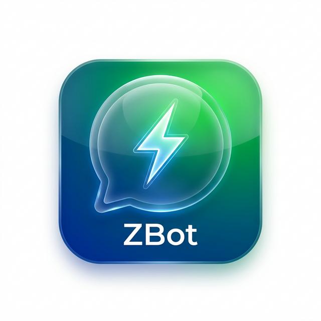

# 🤖 ZBot — Hub Avançado de Automação para WhatsApp

O **ZBot** é uma plataforma robusta e profissional desenvolvida para gerenciar disparos de mensagens, campanhas em massa e fluxos de automação no WhatsApp. Com uma interface moderna, intuitiva e focada em performance, o ZBot permite que você gerencie múltiplos contatos e estratégias de comunicação com segurança e agilidade.

<p align="center">
  
</p>


---

## 🚀 Funcionalidades Principais

### 📡 Painel de Controle (Dashboard)
- Visualização em tempo real do status da conexão (QR Code / Conectado).
- Estatísticas instantâneas de envios (Pendentes, Enviados, Erros).
- Acesso rápido a todas as ferramentas do sistema.

### 👤 Gestão de Contatos
- **Importação Inteligente:** Carregue milhares de contatos via arquivos CSV.
- **Edição Global:** Sistema de edição em tempo real para nomes e números.
- **Limpeza de Base:** Botão rápido para zerar a base de dados (Developer Mode).

### 📂 Acervo de Conteúdo (Biblioteca)
- Registre modelos de mensagens, versículos ou frases promocionais.
- **Sorteio Aleatório:** Envie mensagens diferentes para cada contato utilizando o modo "Sortear do Acervo", reduzindo drasticamente o risco de banimento.

### 📢 Campanhas Controladas
- **Disparos Globais ou Individuais:** Escolha um contato específico ou dispare para toda a base.
- **Agendador Inteligente:** Configure data e hora para o início dos disparos.
- **Recorrência Diária:** Repita suas campanhas automaticamente a cada 24 horas.
- **Delays Aleatórios:** Configure intervalos mínimos e máximos (ex: 10s a 30s) entre mensagens para simular comportamento humano.

### 🌊 Fluxos de Automação (Flows)
- Crie sequências automáticas de mensagens.
- **Etapas Personalizadas:** Defina o texto e o tempo de espera (minutos/horas) para cada passo do fluxo.
- **Controle Total:** Inicie e gerencie fluxos para toda a sua base com um clique.

### 🛠️ Gerenciamento de Fila
- Acompanhe cada mensagem agendada.
- **Flexibilidade Total:** Edite a mensagem ou o horário de um envio que já está na fila.
- **Tentar Novamente:** Botão de reenvio rápido para mensagens que falharam por falta de internet ou erro do servidor.

---

## 🛠️ Tecnologias Utilizadas

O ZBot foi construído com as melhores tecnologias do ecossistema JavaScript:

- **Backend:** Node.js + Express.js
- **Frontend:** Pug (Templates) + Vanilla CSS (Custom Design System)
- **Banco de Dados:** SQLite (Leve, rápido e portátil)
- **WhatsApp API:** [WPPConnect](https://github.com/wppconnect-team/wppconnect)
- **Real-time:** Socket.io
- **Google Antigravity / VSCode**
- **Ícones:** Phosphor Icons

---

## 📦 Instalação e Uso

1. **Clone o repositório:**
   ```bash
   git clone https://github.com/seu-usuario/zbot.git
   cd zbot
   ```

2. **Instale as dependências:**
   ```bash
   npm install
   ```

   (Se estiver rodando no codespaces, execute ```bash scripts/install_puppeteer_deps.sh```)

3. **Inicie o servidor:**
   ```bash
   npm start
   ```

4. **Acesse no navegador:**
   O painel estará disponível em `http://localhost:3000`.

---

## 🛡️ Segurança e Anti-Ban

O ZBot foi projetado com a segurança do seu número em mente:
- **Agendador em Background:** O processamento não trava o navegador e respeita os tempos do servidor.
- **Delays Variáveis:** Nunca envie mensagens no mesmo intervalo de tempo.
- **Trava Anti-Duplicidade:** Mecanismo interno que impede que uma mensagem seja enviada duas vezes por erro de processo.

---

## 📄 Licença

Este projeto está sob a licença MIT. Sinta-se à vontade para utilizar e modificar para seus próprios projetos.

---
*Desenvolvido por MiguelQueiroz010*
